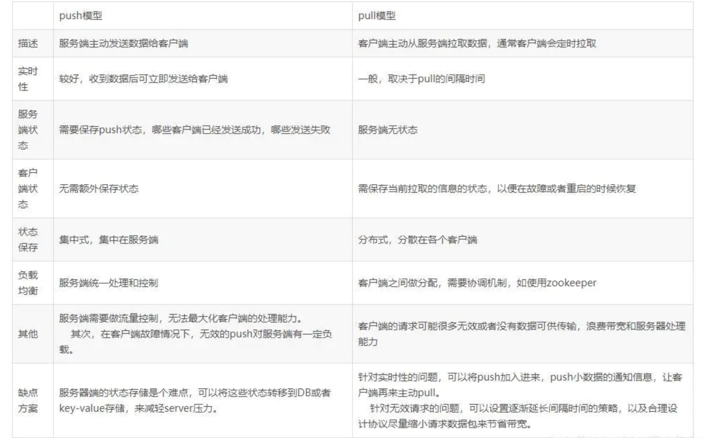

RabbitMQ是一个开源的消息代理和队列服务器，用来通过普通协议在不同的应用之间共享数据(跨平台跨语言)。RabbitMQ是使用Erlang语言编写，并且基于AMQP协议实现。

## RabbitMQ 简介

RabbitMQ 是采用 Erlang 语言实现 AMQP(Advanced Message Queuing Protocol，高级消息队列协议）的消息中间件，它最初起源于金融系统，用于在分布式系统中存储转发消息。

RabbitMQ 发展到今天，被越来越多的人认可，这和它在易用性、扩展性、可靠性和高可用性等方面的卓著表现是分不开的。RabbitMQ 的具体特点可以概括为以下几点：
- 可靠性(Reliablity)：使用了一些机制来保证可靠性，比如持久化、传输确认、发布确认。
- 灵活的路由(Flexible Routing)：在消息进入队列之前，通过 Exchange 来路由消息。对于典型的路由功能，Rabbit 已经提供了一些内置的 Exchange 来实现。针对更复杂的路由功能，可以将多个Exchange绑定在一起，也通过插件机制实现自己的 Exchange。
- 消息集群(Clustering)：多个 RabbitMQ 服务器可以组成一个集群，形成一个逻辑 Broker。
- 高可用(Highly Avaliable Queues)：队列可以在集群中的机器上进行镜像，使得在部分节点出问题的情况下队列仍然可用。
- 多种协议(Multi-protocol)：支持多种消息队列协议，如 STOMP、MQTT 等。
- 多种语言客户端(Many Clients)：几乎支持所有常用语言，比如 Java、.NET、Ruby 等。
- 管理界面(Management UI)：提供了易用的用户界面，使得用户可以监控和管理消息 Broker 的许多方面。
- 跟踪机制(Tracing)：如果消息异常，RabbitMQ 提供了消息的跟踪机制，使用者可以找出发生了什么。
- 插件机制(Plugin System)：提供了许多插件，来从多方面进行扩展，也可以编辑自己的插件。


## RabbitMQ重要概念


首先看一下 RabbitMQ 的整体架构


以及 RabbitMQ 的消息流转图如下：


下面我们根据以上两个图，介绍下 rabbitmq 的一些重要概念：

### 1、Producer(生产者) 和 Consumer(消费者)

- Producer(生产者) :生产消息的一方（邮件投递者）
- Consumer(消费者) :消费消息的一方（邮件收件人）

消息一般由 2 部分组成：消息头（或者说是标签 Label）和 消息体。消息体也可以称为 payLoad ，消息体是不透明的，而消息头则由一系列的可选属性组成，这些属性包括 routing-key（路由键）、priority（相对于其他消息的优先权）、delivery-mode（指出该消息可能需要持久性存储）等。生产者把消息交由 RabbitMQ 后，RabbitMQ 会根据消息头把消息发送给感兴趣的 Consumer(消费者)。


### 2、 Exchange(交换器)

在 RabbitMQ 中，消息并不是直接被投递到 Queue(消息队列) 中的，中间还必须经过 Exchange(交换器) 这一层，Exchange(交换器) 会把我们的消息分配到对应的 Queue(消息队列) 中。

Exchange(交换器) 用来接收生产者发送的消息，并将这些消息路由给服务器中的队列中，如果路由不到，或许会返回给 Producer(生产者) ，或许会被直接丢弃掉 。这里可以将 RabbitMQ 中的交换器看作一个简单的实体。

RabbitMQ 的 Exchange(交换器) 有4种类型，不同的类型对应着不同的路由策略：direct(默认)，fanout, topic, 和 headers，不同类型的Exchange转发消息的策略有所区别。这个会在介绍 Exchange Types(交换器类型) 的时候介绍到。

Exchange(交换器) 示意图如下：


生产者将消息发给交换器的时候，一般会指定一个 RoutingKey(路由键)，用来指定这个消息的路由规则，而这个 **RoutingKey 需要与交换器类型和绑定键(BindingKey)联合使用才能最终生效。**

RabbitMQ 中通过 Binding(绑定) 将 Exchange(交换器) 与 Queue(消息队列) 关联起来，在绑定的时候一般会指定一个 BindingKey(绑定建) ,这样 RabbitMQ 就知道如何正确将消息路由到队列了，如下图所示。

Binding(绑定) 示意图：


一个绑定就是基于路由键将交换器和消息队列连接起来的路由规则，所以可以将交换器理解成一个由绑定构成的路由表。Exchange 和 Queue 的绑定可以是多对多的关系。

生产者将消息发送给交换器时，需要一个 RoutingKey，当 BindingKey 和 RoutingKey 相匹配时，消息会被路由到对应的队列中。在绑定多个队列到同一个交换器的时候，这些绑定允许使用相同的 BindingKey。BindingKey 并不是在所有的情况下都生效，它依赖于交换器类型，比如 fanout 类型的交换器就会无视，而是将消息路由到所有绑定到该交换器的队列中。


### 3、Queue(消息队列)

Queue(消息队列) 用来保存消息直到发送给消费者。它是消息的容器，也是消息的终点。一个消息可投入一个或多个队列。消息一直在队列里面，等待消费者连接到这个队列将其取走。

RabbitMQ 中消息只能存储在队列中，这一点和 Kafka 这种消息中间件相反。Kafka 将消息存储在 topic（主题） 这个逻辑层面，而相对应的队列逻辑只是topic 实际存储文件中的位移标识。RabbitMQ 的生产者生产消息。并最终投递到队列中，消费者可以从队列中获取消息并消费。

多个消费者可以订阅同一个队列，这时队列中的消息会被平均分摊（Round-Robin，即轮询）给多个消费者进行处理，而不是每个消费者都收到所有的消息并处理，这样避免的消息被重复消费。

RabbitMQ 不支持队列层面的广播消费，如果有广播消费的需求，需要在其上进行二次开发，这样会很麻烦，不建议这样做。

### 4、Broker（消息中间件的服务节点）

对于 RabbitMQ 来说，一个 RabbitMQ Broker 可以简单地看作一个 RabbitMQ 服务节点，或者 RabbitMQ 服务实例。大多数情况下也可以将一个 RabbitMQ Broker 看作一台 RabbitMQ 服务器。

下图展示了生产者将消息存入 RabbitMQ Broker,以及消费者从Broker中消费数据的整个流程。


关于 RabbitMQ 的基本概念介绍完毕了，下面再来介绍一下 Exchange Types(交换器类型) 。

### 5、Exchange Types(交换器类型)

RabbitMQ 常用的 Exchange Type 有 fanout、direct、topic、headers 这四种。

#### 第1种、fanout

fanout 类型的 Exchange 路由规则非常简单，它会把所有发送到该 Exchange 的消息路由到所有与它绑定的 Queue 中，不需要做任何判断操作，所以 fanout 类型是所有的交换机类型里面速度最快的。fanout 类型常用来广播消息。

#### 第2种、direct

direct 类型的 Exchange 路由规则也很简单，它会把消息路由到那些 Bindingkey 与 RoutingKey 完全匹配的 Queue 中。


以上图为例，如果发送消息的时候设置路由键为“warning”，那么消息会路由到 Queue1 和 Queue2。如果在发送消息的时候设置路由键为"Info”或者"debug”，消息只会路由到 Queue2。如果以其他的路由键发送消息，则消息不会路由到这两个队列中。

direct 类型常用在处理有优先级的任务，根据任务的优先级把消息发送到对应的队列，这样可以指派更多的资源去处理高优先级的队列。

#### 第3种、topic

前面讲到 direct 类型的交换器路由规则是完全匹配 BindingKey 和 RoutingKey ，但是这种严格的匹配方式在很多情况下不能满足实际业务的需求。topic类型的交换器在匹配规则上进行了扩展，它与 direct 类型的交换器相似，也是将消息路由到 BindingKey 和 RoutingKey 相匹配的队列中，但这里的匹配规则有些不同，它约定：
- RoutingKey 为一个点号“．”分隔的字符串（被点号“．”分隔开的每一段独立的字符串称为一个单词），如 “com.rabbitmq.client”、“java.util.concurrent”、“com.hidden.client”;
- BindingKey 和 RoutingKey 一样也是点号“．”分隔的字符串；
- BindingKey 中可以存在两种特殊字符串“*”和“#”，用于做模糊匹配，其中“*”用于匹配一个单词，“#”用于匹配多个单词(可以是零个)。


以上图为例：
- 路由键为 “com.rabbitmq.client” 的消息会同时路由到 Queuel 和 Queue2;
- 路由键为 “com.hidden.client” 的消息只会路由到 Queue2 中；
- 路由键为 “com.hidden.demo” 的消息只会路由到 Queue2 中；
- 路由键为 “java.rabbitmq.demo” 的消息只会路由到Queuel中；
- 路由键为 “java.util.concurrent” 的消息将会被丢弃或者返回给生产者（需要设置 mandatory 参数），因为它没有匹配任何路由键。


#### 第4种、headers(不推荐)

headers 类型的交换器不依赖于路由键的匹配规则来路由消息，而是根据发送的消息内容中的 headers 属性进行匹配。在绑定队列和交换器时制定一组键值对，当发送消息到交换器时，RabbitMQ 会获取到该消息的 headers（也是一个键值对的形式)，对比其中的键值对是否完全匹配队列和交换器绑定时指定的键值对，如果完全匹配则消息会路由到该队列，否则不会路由到该队列。

headers 类型的交换器性能会很差，而且也不实用，基本上不会看到它的存在。

### ConnectionFactory、Connection、Channel

ConnectionFactory、Connection、Channel 都是 RabbitMQ 对外提供的API中最基本的对象。

Connection 是 RabbitMQ 的 socket 链接，它封装了 socket 协议相关部分逻辑。ConnectionFactory 为 Connection 的制造工厂。

Channel 是我们与 RabbitMQ 打交道的最重要的一个接口，我们大部分的业务操作是在 Channel 这个接口中完成的，包括定义 Queue、定义 Exchange、绑定 Queue 与 Exchange、发布消息等。


## RabbitMQ 消费端限流、重回队列、TTL与死信队列

在实际场景中，如果 MQ 服务器上有数以万计未处理的消息，当我们打开一个消费者客户端时，海量消息瞬间全部推送过来，而单个客户端无法同时处理这么多数据，很可能导致服务性能下降、卡顿，甚至资源耗尽。
我们无法限制生产端生产消息，只能在消费端进行限流，以应对巨量消息待处理的情况。

RabbitMQ 提供了一种 qos（服务质量保证）功能，即在非自动确认消息的前提下，如果一定数目的消息在未被确认前，就不会消费（处理）新的消息。


### TTL

TTL(Time To Live)：生存时间。RabbitMQ 支持消息的过期时间，一共两种。
- 在消息发送时可以进行指定。通过配置消息体的 properties，可以指定当前消息的过期时间。
- 在创建 Exchange 时可进行指定。从进入消息队列开始计算，只要超过了队列的超时时间配置，那么消息会自动清除。

### 死信队列 DLX

死信队列(DLX Dead-Letter-Exchange)：利用DLX，当消息在一个队列中变成死信(dead message)之后，它能被重新 publish 到另一个 Exchange，这个Exchange 就是 DLX。

DLX 也是一个正常的 Exchange，和一般的 Exchange 没有区别，它能在任何的队列上被指定，实际上就是设置某个队列的属性。

当这个队列中有死信时，RabbitMQ 就会自动的将这个消息重新发布到设置的 Exchange 上去，进而被路由到另一个队列。

可以监听这个队列中消息做相应的处理，这个特性可以弥补 RabbitMQ3.0 之前支持的 immediate 参数的功能。


消息变成死信的几种情况：
- 消息被拒绝(basic.reject/basic.nack)并且requeue=false
- 消息TTL过期
- 队列达到最大长度
- 死信队列设置：需要设置死信队列的 exchange 和 queue，然后通过 routing key 进行绑定。只不过我们需要在队列加上一个参数即可。

死信队列设置（消费端）：需要设置死信队列的 exchange 和 queue，然后通过 routing key 进行绑定。只不过我们需要在队列加上一个参数即可。

#### 以消息过期为例：

消费端的代码：
```
channel.confirmSelect();

String exchangeName = "exchange_dlx";
String routingKey = "*.dlx";
String queueName = "queue_dlx";

Map<String, Object> arguments = new HashMap<String, Object>();
arguments.put("x-dead-letter-exchange", "dlx.real.exchange");  // 值为 声明的死信队列的名称，自己取名

channel.exchangeDeclare(exchangeName, "topic", true);
// 设置死信队列属性，注意是设置在队列声明上
channel.queueDeclare(queueName, true, false, false, arguments);
channel.queueBind(queueName, exchangeName, routingKey);

// 声明死信队列
channel.exchangeDeclare("dlx.real.exchange", "topic", true);  //注意名称与前面设置的死信队列的值一致
channel.queueDeclare("dlx.real.queue", true, false, false, null);
channel.queueBind("dlx.real.queue", "dlx.real.exchange", "#");  // # 表示所有的键都可以路由到这个队列
```

生产端的代码：
```
channel.confirmSelect();

String exchangeName = "exchange_dlx";
String routingKey = "test.dlx";
String msg = "hello, rabbitmq, dlx qos ";

// 发送3条消息
for(int i = 0; i < 3; i++) {
  AMQP.BasicProperties properties = new AMQP.BasicProperties().builder()
      .deliveryMode(2)
      .contentEncoding("UTF-8")
      .expiration("10000")   // 该消息10 秒过期，过期后将进入死信队列
      .build();
  channel.basicPublish(exchangeName, routingKey, properties, msg.getBytes());
}

System.out.println("生产端消息已发送==" + msg);
```

只需要通过监听该死信队列即可处理死信消息。还可以通过死信队列完成延时队列。


### 消费端ACK与NACK

消费端进行消费的时候，如果由于业务异常可以进行日志的记录，然后进行补偿。由于服务器宕机等严重问题，我们需要手动进行 ACK 保障消费端消费成功。

消费端重回队列是为了对没有成功处理消息，把消息重新返回到 Broker。一般来说，实际应用中都会关闭重回队列，也就是设置为 false。

```
// deliveryTag：消息在mq中的唯一标识
// multiple：是否批量(和qos设置类似的参数)
// requeue：是否需要重回队列。或者丢弃或者重回队首再次消费。
public void basicNack(long deliveryTag, boolean multiple, boolean requeue) 
```

### 生产者Confirm机制

- 消息的确认，是指生产者投递消息后，如果 Broker 收到消息，则会给我们生产者一个应答。
- 生产者进行接受应答，用来确认这条消息是否正常的发送到了 Broker，这种方式也是消息的可靠性投递的核心保障!


实现步骤：
1、在channel上开启确认模式：channel.confirmSelect()
2、在channel上开启监听：addConfirmListener，监听成功和失败的处理结果，根据具体的结果对消息进行重新发送或记录日志处理等后续操作。


### Return消息机制

Return Listener用于处理一些不可路由的消息。

我们的消息生产者，通过指定一个Exchange和Routing，把消息送达到某一个队列中去，然后我们的消费者监听队列进行消息的消费处理操作。

但是在某些情况下，如果我们在发送消息的时候，当前的exchange不存在或者指定的路由key路由不到，这个时候我们需要监听这种不可达消息，就需要使用到Returrn Listener。

基础API中有个关键的配置项Mandatory：如果为true，监听器会收到路由不可达的消息，然后进行处理。如果为false，broker端会自动删除该消息。

通过chennel.addReturnListener(ReturnListener rl)传入已经重写过handleReturn方法的ReturnListener。


### 消费端自定义监听(推模式和拉模式pull/push)

- 一般通过 while 循环进行 consumer.nextDelivery() 方法进行获取下一条消息进行那个消费。(通过 while 将拉模式模拟成推模式，但是死循环会耗费 CPU 资源。)
- 通过自定义 Consumer，实现更加方便、可读性更强、解耦性更强的方式。(现默认使用的模式，直接订阅到 queue 上，如果有数据，就等待 mq 推送过来)


```
Basic.Consume将信道(Channel)置为接收模式，直到取消队列的订阅为止。
在接受模式期间，RabbitMQ会不断的推送消息给消费者。
当然推送消息的个数还是受Basic.Qos的限制。
如果只想从队列获得单条消息而不是持续订阅，建议还是使用Basic.Get进行消费。
但是不能将Basic.Get放在一个循环里来代替Basic.Consume，这样会严重影响RabbitMQ的性能。
如果要实现高吞吐量，消费者理应使用Basic.Consume方法。
```




### 消费端限流整体示例

在实际场景中，如果 MQ 服务器上有数以万计未处理的消息，当我们打开一个消费者客户端时，海量消息瞬间全部推送过来，而单个客户端无法同时处理这么多数据，很可能导致服务性能下降、卡顿，甚至资源耗尽。
我们无法限制生产端生产消息，只能在消费端进行限流，以应对巨量消息待处理的情况。

#### 生产端 MyProducer.java

```
public class MyProducer {
	public static void main(String[] args) throws Exception {
		ConnectionFactory connectionFactory = new ConnectionFactory();
		connectionFactory.setHost("192.168.0.125");
		connectionFactory.setPort(5672);
		connectionFactory.setVirtualHost("/");
		
		Connection connection = connectionFactory.newConnection();
		Channel channel = connection.createChannel();
		channel.confirmSelect();
		
		String exchangeName = "exchange_qos";
		String routingKey = "test.qos";
		String msg = "hello, rabbitmq, test qos ";
		
		// 发送10条消息
		for(int i = 0; i < 10; i++) {
			channel.basicPublish(exchangeName, routingKey, null, msg.getBytes());
		}
		
		System.out.println("生产端消息已发送==" + msg);
		
	}

}

```

#### 消费端 MyConsumer.java

```
public class MyConsumer {
	public static void main(String[] args) throws Exception {
		ConnectionFactory connectionFactory = new ConnectionFactory();
		connectionFactory.setHost("192.168.0.125");
		connectionFactory.setPort(5672);
		connectionFactory.setVirtualHost("/");
		
		Connection connection = connectionFactory.newConnection();
		Channel channel = connection.createChannel();
		channel.confirmSelect();
		
		String exchangeName = "exchange_qos";
		String routingKey = "*.qos";
		String queueName = "queue_qos";
		
		channel.exchangeDeclare(exchangeName, "topic", true);
		channel.queueDeclare(queueName, true, false, false, null);
		channel.queueBind(queueName, exchangeName, routingKey);

		//channel.basicQos(prefetchSize, prefetchCount, global);
		/**
		 * prefetchSize: 处理单条消息的大小限制，0 表示不限制
		 * prefetchCount： 单次处理的消息条数；处理完n条消息发送一个ack，然后再推送n条消息进行处理
		 * global： 是否将该设置应用在 channel；  该设置是 channel 级别还是 consumer 级别
		 */
		channel.basicQos(0, 3, false);
		
		Consumer consumer = new DefaultConsumer(channel) {
			@Override
            public void handleDelivery(String consumerTag,
                                       Envelope envelope,
                                       AMQP.BasicProperties properties,
                                       byte[] body) throws IOException {

				String msg = new String(body, "UTF-8");
                String exchange = envelope.getExchange();
                String routingKey = envelope.getRoutingKey();
                long deliveryTag = envelope.getDeliveryTag();
                System.err.println("消费端收到 message : " + msg);
                
                // 手动签收，返回 ack
                // 如果注释该行，消费端只能处理第一次接收的n条消息；因为消费端没有返回 ack， Broker没有收到ack，以为消费端还没有处理完上一批消息而不再推送下一批消息。
              //  channel.basicAck(deliveryTag, false); //multiple：false---不批量处理
			}
		};
		
		// 自动签收(autoAck)设置为 false
		channel.basicConsume(queueName, false, consumer);
		
	}
}
```

## 如何保证可靠性？

什么是生产端的可靠性投递？
- 保证消息的成功发出
- 保障MQ节点的成功接受
- 发送端收到MQ节点(Broker)确认应答
- 完善消息的补偿机制

### 解决方案1 
消息落库，对消息状态进行变更。

缺点：对数据库有多次操作。不适用于高并发业务。


### 解决方案2 
消息的延迟投递，做二次确认，回调检查。


```
拆出一个回调服务。将落库、检查等操作安排至回调服务上。
1：发送者发送信息至 MQ，消费者为下游业务方。
      1.1：成功后，作为发送者发送信息至 MQ，消费者为回调服务。
              1.1.1 回调服务接受数据后，落库。
       1.2：失败，等待发送者的延时投递信息。
2、发送者发送延迟投递信息至MQ，消费者为回调服务。
      1.1：查库，确认下游服务方消费已成功。
      1.2：查库，确认下游服务方消费失败，通过rpc调用发送者的接口重新发送。
```

消息发送者发送的两条信息是同时发送的。

减少了对库的操作，同时解耦，保证了性能，不能百分百保证可靠性


