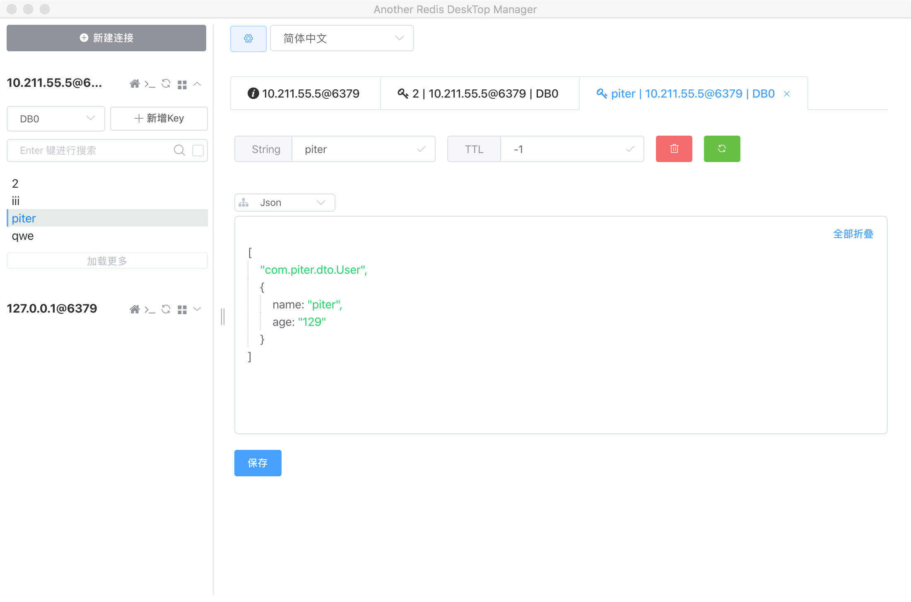

从 Spring Boot 2.x 开始 Lettuce 已取代 Jedis 成为首选 Redis 的客户端。当然 Spring Boot 2.x 仍然支持 Jedis，并且你可以任意切换客户端。


## Lettuce

Lettuce 是一个可伸缩的线程安全的 Redis 客户端，支持同步、异步和响应式模式。多个线程可以共享一个连接实例，不必担心多线程并发问题。它基于优秀 Netty NIO 框架构建，支持 Redis 的高级功能，如 Sentinel、集群、流水线、自动重新连接和 Redis 数据模型。

Jedis 在实现上是直接连接的 redis server，如果在多线程环境下是非线程安全的，这个时候只有使用连接池，为每个 Jedis 实例增加物理连接。

Lettuce 的连接是基于 Netty 的，连接实例 (StatefulRedisConnection) 可以在多个线程间并发访问。，因为 StatefulRedisConnection 是线程安全的，所以一个连接实例  (StatefulRedisConnection) 就可以满足多线程环境下的并发访问。
 
## Spring Boot 2.0 集成 redis

Spring Boot 2.0 集成 redis，一般需要4步
1. 引入依赖
2. 配置 redis
3. 自定义 RedisTemplate (推荐)
4. 自定义 redis 操作类 (推荐)

### 引入依赖

引入 lettuce pool 缓存连接池 、redis 以及 一些常用的依赖。

```
<dependencies>
    <dependency>
        <groupId>org.springframework.boot</groupId>
        <artifactId>spring-boot-starter-web</artifactId>
    </dependency>

    <dependency>
        <groupId>org.springframework.boot</groupId>
        <artifactId>spring-boot-devtools</artifactId>
        <scope>runtime</scope>
        <optional>true</optional>
    </dependency>
    <dependency>
        <groupId>org.projectlombok</groupId>
        <artifactId>lombok</artifactId>
        <optional>true</optional>
    </dependency>

    <dependency>
        <groupId>org.springframework.boot</groupId>
        <artifactId>spring-boot-starter-data-redis</artifactId>
    </dependency>

    <dependency>
        <groupId>org.apache.commons</groupId>
        <artifactId>commons-pool2</artifactId>
    </dependency>

    <dependency>
        <groupId>com.fasterxml.jackson.core</groupId>
        <artifactId>jackson-databind</artifactId>
    </dependency>

</dependencies>
```

- 如果用的是 lettuce 客户端，需要引入 commons-pool2 连接池。
- 如果想用 json 序列化 redis 的 value 值，需要引入 jackson

### 配置 redis

详细的配置如下，已经添加备注：

```
spring.application.name=redis-demo
server.port=8090

# redis 服务端相关配置
# 服务器地址
spring.redis.host=10.211.55.5
# 端口号
spring.redis.port=6379
# 密码，默认为 null
spring.redis.password=redis123456
# 使用的数据库，默认选择下标为0的数据库
spring.redis.database=0
# 客户端超时时间,默认是2000ms
spring.redis.timeout=2000ms


## jedis 客户端配置(从 Spring Boot 2.x 开始，不再推荐使用 jedis 客户端)
## 建立连接最大等待时间，默认1ms，超出该时间会抛异常。设为-1表示无限等待，直到分配成功。
#spring.redis.jedis.pool.max-wait=1ms
## 最大连连接数，默认为8，负值表示没有限制
#spring.redis.jedis.pool.max-active=8
## 最大空闲连接数,默认8。负值表示没有限制
#spring.redis.jedis.pool.max-idle=8
## 最小空闲连接数,默认0。
#spring.redis.jedis.pool.min-idle=0


# lettuce 客户端配置(从 Spring Boot 2.x 开始，推荐使用 lettuce 客户端)
# 建立连接最大等待时间，默认1ms，超出该时间会抛异常。设为-1表示无限等待，直到分配成功。
spring.redis.lettuce.pool.max-wait=1ms
# 最大连连接数，默认为8，负值表示没有限制
spring.redis.lettuce.pool.max-active=8
# 最大空闲连接数,默认8。负值表示没有限制
spring.redis.lettuce.pool.max-idle=8
# 最小空闲连接数,默认0。
spring.redis.lettuce.pool.min-idle=0
# 设置关闭连接的超时时间
spring.redis.lettuce.shutdown-timeout=100ms

```

### 自定义 RedisTemplate

RedisTemplate 是 spring 为我们提供的 redis 操作类，通过它我们可以完成大部分 redis 操作。

只要我们引入了 redis 依赖，并将 redis 的连接信息配置正确，springboot 就会根据我们的配置会给我们生成默认 RedisTemplate。

但是默认生成的 RedisTemplate 有两个地方不是很符合日常开发中的使用习惯
- 默认生成的 RedisTemplate  接收的key和value为泛型，经常需要类型转换，直接使用不是很方便。
- 默认生成的 RedisTemplate 序列化时，使用的是 JdkSerializationRedisSerializer ，存储到 redis 中后，内容为二进制字节，不利于查看原始内容

对于第一个问题，一般习惯将 RedisTemplate 接收的 key 改为 String 类型，接收的 value 改为 Object 类型。

对于第二个问题,一般会把数据序列化为 json 格式，然后存储到 redis 中，序列化成 json 格式还有一个好处就是跨语言，其他语言也可以读取你存储在 redis 中的内容。

为了实现上面两个目的，我们需要自定义自己的 RedisTemplate。

如下，创建一个 config 类，在里面配置 自定义的 RedisTemplate：

```java
package com.piter.config;

import com.fasterxml.jackson.annotation.JsonAutoDetect;
import com.fasterxml.jackson.annotation.PropertyAccessor;
import com.fasterxml.jackson.databind.ObjectMapper;
import org.springframework.boot.autoconfigure.AutoConfigureAfter;
import org.springframework.boot.autoconfigure.data.redis.RedisAutoConfiguration;
import org.springframework.context.annotation.Bean;
import org.springframework.context.annotation.Configuration;
import org.springframework.data.redis.connection.RedisConnectionFactory;
import org.springframework.data.redis.core.RedisTemplate;
import org.springframework.data.redis.serializer.Jackson2JsonRedisSerializer;
import org.springframework.data.redis.serializer.StringRedisSerializer;

@Configuration
// 控制配置类的加载顺序,先加载 RedisAutoConfiguration.class 再加载该类,这样才能覆盖默认的 RedisTemplate
@AutoConfigureAfter(RedisAutoConfiguration.class)
public class RedisConfig {
    /**
     * 自定义 redisTemplate （方法名一定要叫 redisTemplate 因为 @Bean 是根据方法名配置这个bean的name的）
     * 默认的 RedisTemplate<K,V> 为泛型，使用时不太方便，自定义为 <String, Object>
     * 默认序列化方式为 JdkSerializationRedisSerializer 序列化后的内容不方便阅读，改为序列化成 json
     *
     * @param redisConnectionFactory
     * @return
     */
    @Bean
    RedisTemplate<String, Object> redisTemplate(RedisConnectionFactory redisConnectionFactory) {
        // 配置 json 序列化器 - Jackson2JsonRedisSerializer
        Jackson2JsonRedisSerializer jacksonSerializer = new Jackson2JsonRedisSerializer<>(Object.class);
        ObjectMapper objectMapper = new ObjectMapper();
        objectMapper.setVisibility(PropertyAccessor.ALL, JsonAutoDetect.Visibility.ANY);
        objectMapper.enableDefaultTyping(ObjectMapper.DefaultTyping.NON_FINAL);
        jacksonSerializer.setObjectMapper(objectMapper);

        // 创建并配置自定义 RedisTemplateRedisOperator
        RedisTemplate<String, Object> template = new RedisTemplate<>();
        template.setConnectionFactory(redisConnectionFactory);
        // 将 key 序列化成字符串
        template.setKeySerializer(new StringRedisSerializer());
        // 将 hash 的 key 序列化成字符串
        template.setHashKeySerializer(new StringRedisSerializer());
        // 将 value 序列化成 json
        template.setValueSerializer(jacksonSerializer);
        // 将 hash 的 value 序列化成 json
        template.setHashValueSerializer(jacksonSerializer);
        template.afterPropertiesSet();
        return template;
    }
}

```


### 自定义 Redis 操作类

虽然 RedisTemplate 已经对 redis 的操作进行了一定程度的封装，但是直接使用还是有些不方便，实际开发中，一般会对 RedisTemplate 做进一步封装，形成方便使用的Redis 操作类。

#### BaseRedisOperator

该类的设计思路是，与 Redis 命令语法及格式保持一致，以达到使用该类与直接使用 Redis 命令相似的体验。

由于 Redis 命令众多，并没有实现全部的命令，而是实现了常用的大部分命令。

代码详见：

[springboot-redis-integration](https://github.com/piterjia/springboot-redis-integration)

#### RedisOperator

RedisOperator 类在 BaseRedisOperator 的基础上补充了一下无法按照 Redis 命令 设计的类。

使用该类并不会给你带来类似直接使用Redis 命令的体验

代码详见：

[springboot-redis-integration](https://github.com/piterjia/springboot-redis-integration)


#### 自测试

编写自测试代码，进行功能验证。

1、编写 service
```
@Service
public class RedisService {
    @Autowired
    private RedisOperator redisOperator;

    public void redisAddKey(String key, String value) {
        redisOperator.set(key, value);
    }

    public String redisGetKey(String key) {
        String redisValue = (String) redisOperator.get(key);
        return redisValue;
    }

    public void redisAddUser(String key, Object value) {
        redisOperator.set(key, value);
    }

    public User redisGetUser(String key) {
        User redisValue = (User) redisOperator.get(key);
        return redisValue;
    }
}
```

2、编写 Controller

```
@RestController
@RequestMapping("redis")
public class RedisController {

    @Autowired
    RedisService redisService;

    @RequestMapping(value = "add", method = RequestMethod.GET)
    public String redisAdd(@RequestParam String key, @RequestParam String value){
        redisService.redisAddKey(key, value);


        return redisService.redisGetKey(key);
    }

    @RequestMapping(value = "addObject", method = RequestMethod.POST)
    public User redisAdd(@RequestParam String key, @RequestBody User user){
        redisService.redisAddUser(key, user);
        return redisService.redisGetUser(key);
    }
}
```

3、postman 发起自测试

可以看到，数据被正确写入 redis 中，spring boot 成功集成 redis 。




## 总结

至此，我们就完成了 spring boot 集成 redis 的功能。


## github地址：

[springboot-redis-integration](https://github.com/piterjia/springboot-redis-integration)

